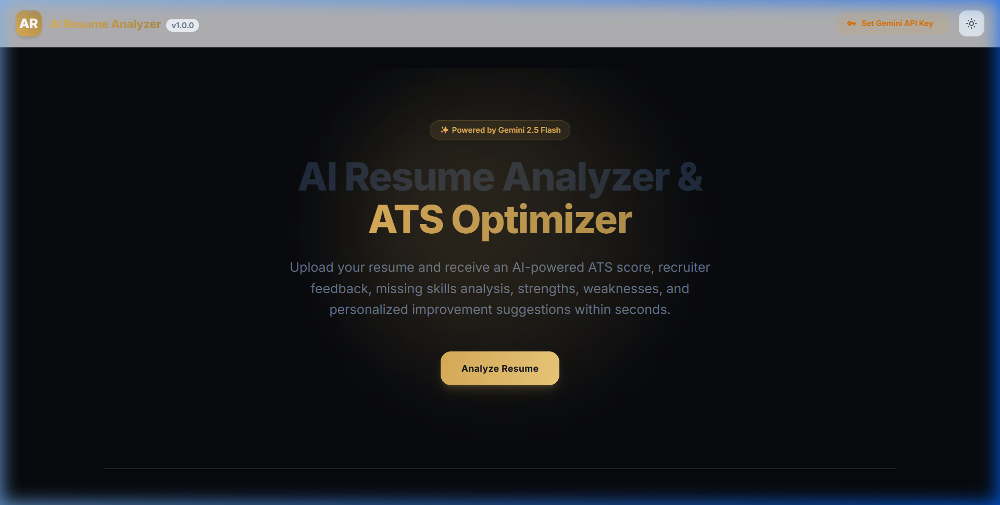
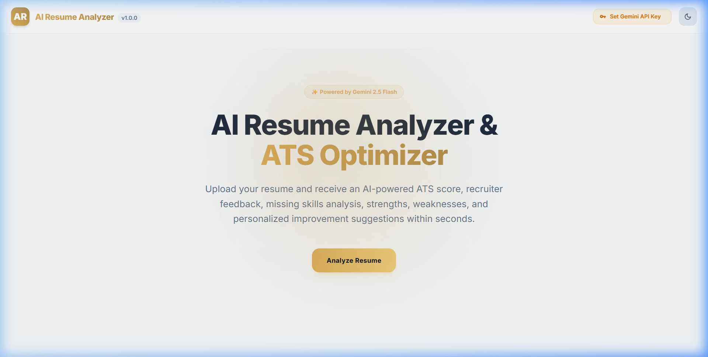

# 🌟 AI Resume Analyser & ATS Optimizer

An AI-powered Applicant Tracking System (ATS) optimizer and Resume Analyzer built with **React**, **Vite**, and **Tailwind CSS v4**, powered by the **Google Gemini 2.5 Flash** model. 

This tool helps job seekers evaluate their resumes against standard recruiting metrics, detect formatting errors, find missing keyword alignments, and receive professional recruiter feedback to maximize their callback rates.

---

## 📸 Visual Showcase

### Midnight Gold Dark Mode (Default)
A premium obsidian-black workspace with golden accents designed for a state-of-the-art tech aesthetic.



### Clean Off-White Light Mode
A warm cream background with brass-borders and golden accents, maintaining high-contrast readability.



### 🎬 Interactive Demo
Watch the tool in action: setting the Gemini API key, uploading a resume, and navigating the interface.


---

## 🚀 Key Features

* **Instant ATS Score**: Get a score showing how well your resume matches standard recruiter and ATS filters.
* **Critiques & Structural Checks**: In-depth analysis across Resume Summary, Skills, Projects, Experience, and Education.
* **Missing Keywords Detection**: Highlight vital industry-specific action verbs and tech keywords absent from your resume.
* **Recruiter Feedback Accordion**: Read custom feedback from the perspective of an experienced hiring manager.
* **Strengths & Weaknesses Breakdown**: Easily digestible reports on passive voice usage, spelling errors, structural issues, and quantifiable metrics.
* **Export & Print Ready**: Download analysis reports in clean JSON layouts, or print them directly using customized, print-optimized css styling sheet.
* **In-Memory Security**: Your Gemini API Key is stored solely in-memory inside the browser and is never sent to any server other than Google's Gemini endpoint directly.

---

## 🛠️ Technology Stack

* **Core**: React 19, Vite 8
* **Styling**: Tailwind CSS v4 (configured with CSS theme tokens)
* **Animations**: Framer Motion
* **Visual Data**: Recharts (Pie & Bar charts for score distribution)
* **File Parsing**: 
  - `mammoth`: High-fidelity `.docx` text extraction
  - `pdfjs-dist`: High-performance `.pdf` document text extraction
* **AI Model**: `@google/generative-ai` (Gemini 2.5 Flash)

---

## ⚙️ Getting Started

### Prerequisites
Make sure you have **Node.js** (v18+) and **npm** installed on your system.

### 1. Clone & Navigate
```bash
git clone https://github.com/sairohhit14/Resume-Analyser.git
cd Resume-Analyser
```

### 2. Install Dependencies
```bash
npm install
```

### 3. Start Development Server
```bash
npm run dev
```
Once started, open your browser and navigate to `http://localhost:5173/`.

### 4. Build for Production
```bash
npm run build
```

---

## 🔑 Configure Gemini API Key
To execute the AI resume analysis:
1. Obtain a free API Key from [Google AI Studio](https://aistudio.google.com/).
2. Click **"Set Gemini API Key"** in the top navigation bar of the application.
3. Paste the key and click **"Save Key"**. The key remains in your local browser state and will reset upon page reload.
